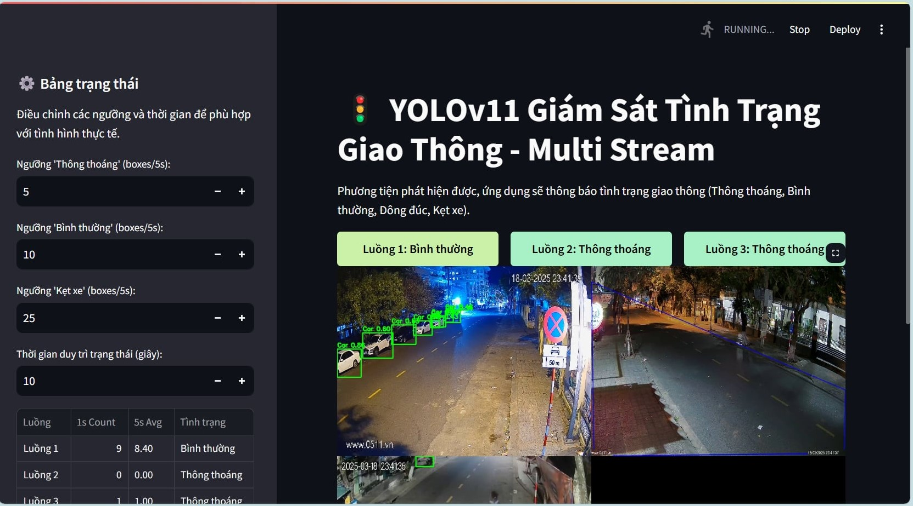

# Ý tưởng ban đầu
Fine-tuning model yolo11n.pt để nhận diện phương tiện giao thông ở Việt Nam trên dataset riêng (có chứa label nhận diện cho 4 class là car, motorcycle, truck và bus).
Sau đó dùng model fine-tuned để xây dựng web application giám sát số lượng phương tiện tham gia giao thông qua nhiều camera đường phố và thông báo kết quả (vd: đường A - kẹt xe, đường B - thông thoáng).
# Phát hiện và cải tiến
Sau khi fine-tuned model yolo dựa trên ý tưởng đề ra, kết quả predict (image_results\predict_on_best.pt_model) cho ra không tốt. 
Nhận ra yolo11n.pt là model đã được train trên 80 class bằng dataset COCO trong đó có cả các class phương tiện giao thông đường bộ (car, motorcycle, bus, truck,...).
Hướng đi mới: dùng lại model yolo11n.pt và hàm filter để chỉ nhận diện các class cần thiết, kết quả cho ra tốt hơn (image_results\predict_on_pretrained_model_filter)
# Kết quả được trực quan hóa bằng Streamlit trên 3 link video youtube trực tiếp.

