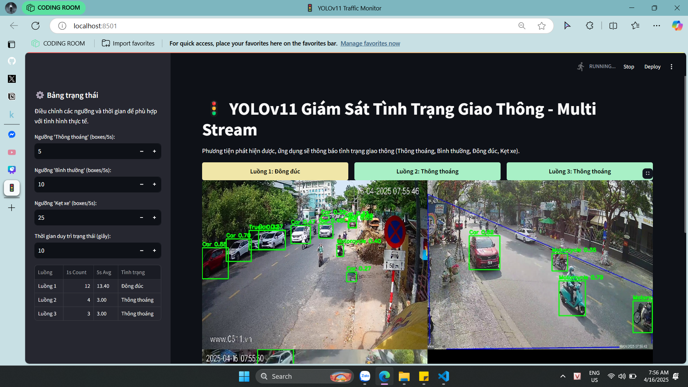

# Initial Idea  
Fine-tune the model `yolo11n.pt` to detect vehicles in Vietnam using a custom dataset (with labels for 4 classes: car, motorcycle, truck, and bus).  
Then, use the fine-tuned model to build a web application that monitors the number of vehicles on the road through multiple street cameras and reports the results (e.g., Street A – traffic jam, Street B – clear).

# Findings and Improvements  
After fine-tuning the YOLO model based on the initial idea, the prediction results (`image_results\predict_on_best.pt_model`) were not good.  
It was realized that `yolo11n.pt` is a model trained on 80 classes using the COCO dataset, which already includes road vehicle classes (car, motorcycle, bus, truck, etc.).  
New approach: reuse the `yolo11n.pt` model and apply a filter function to only detect the necessary classes. This yielded better results (`image_results\predict_on_pretrained_model_filter`).

# Results Visualized  
Results visualized using Streamlit on 3 live YouTube video streams.  

This result could be improved by using a larger YOLO model and a more stable live video stream. Since this is real-time monitoring, the video FPS may be unstable; however, for the purpose of simulation and research for future development, this web application meets the requirements.
